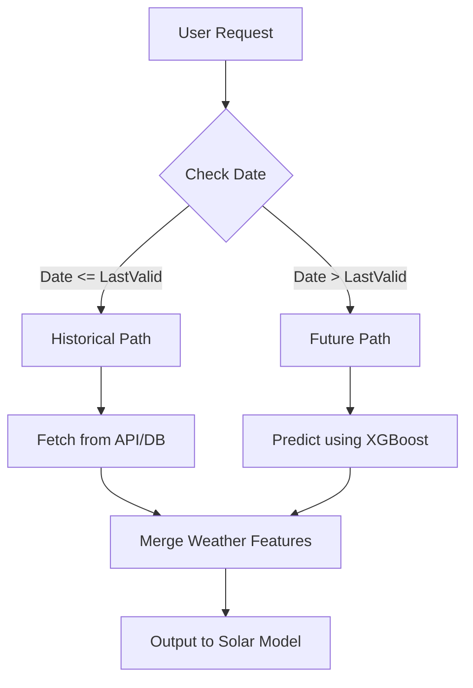

# Weather Fetcher Component

## Overview

The Weather Fetcher is responsible for providing the meteorological context required by the Solar Model. Since solar generation is directly dependent on weather (irradiance, temperature, cloud cover), this component ensures accurate weather inputs for any given date.

It implements a **Hybrid Pipeline** that seamlessly switches between historical ground-truth data and future predictive modeling.

## The Hybrid Logic

The system divides time into two zones based on the **Last Valid Date**:

1.  **Historical Zone** (Dates $\le$ Last Valid Date)
2.  **Future Zone** (Dates $>$ Last Valid Date)

### 1. Last Valid Date Determination

*   **Concept**: We need to know when our "real" data ends.
*   **Mechanism**:
    *   On startup, `_update_last_valid_date()` reads the `WEATHER_HIST_FILE`.
    *   It scans for the `MISSING_VALUE` marker (`-999`).
    *   The last timestamp *before* the first `-999` is cached as `last_valid_date`.
    *   This prevents the system from reading the file on every request (Performance Optimization).

### 2. Historical Data Retrieval

*   **Function**: `_fetch_weather_from_api(input_df)`
*   **Logic**:
    *   Identifies rows in the request that fall within the Historical Zone.
    *   *Current Implementation*: Simulates an API fetch by using the weather model to fill data (Prototype).
    *   *Target Implementation*: Should query an external Weather API (e.g., NASA POWER, OpenWeather) to get actual observed values.

### 3. Future Rolling Prediction

*   **Function**: `_predict_rolling_weather(input_df, last_valid_date)`
*   **Logic**:
    *   Identifies rows in the Future Zone.
    *   Uses the trained **Weather XGBoost Model** (`weather_model_bundle`) to forecast weather conditions.
    *   **Rolling Window**: For accurate long-term forecasting, the model uses a sliding window of past days to predict the next day.

## Data Flow Diagram

## Key Configuration

*   `WEATHER_HIST_FILE`: Path to the CSV used to determine the Last Valid Date.
*   `MISSING_VALUE`: The marker used to denote invalid/missing data (Default: `-999`).
*   `weather_model_bundle`: The ML model used for the Future Path.